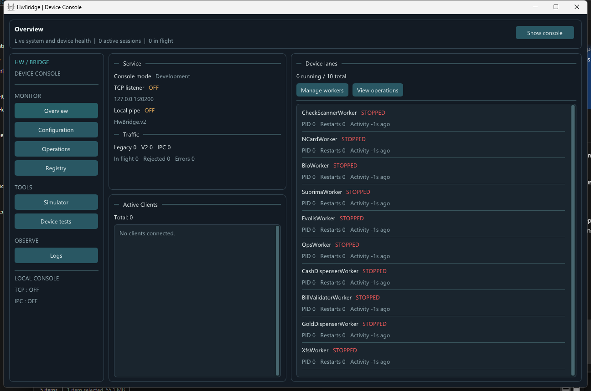
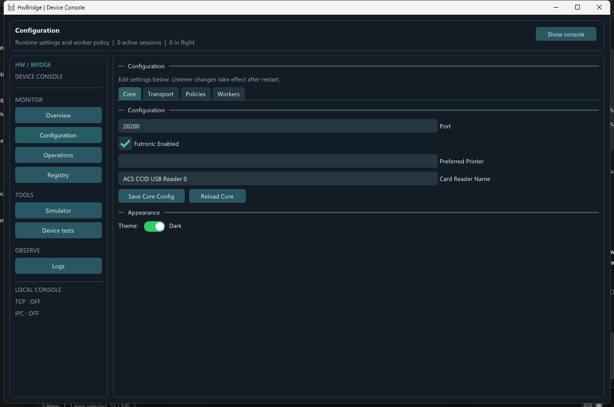
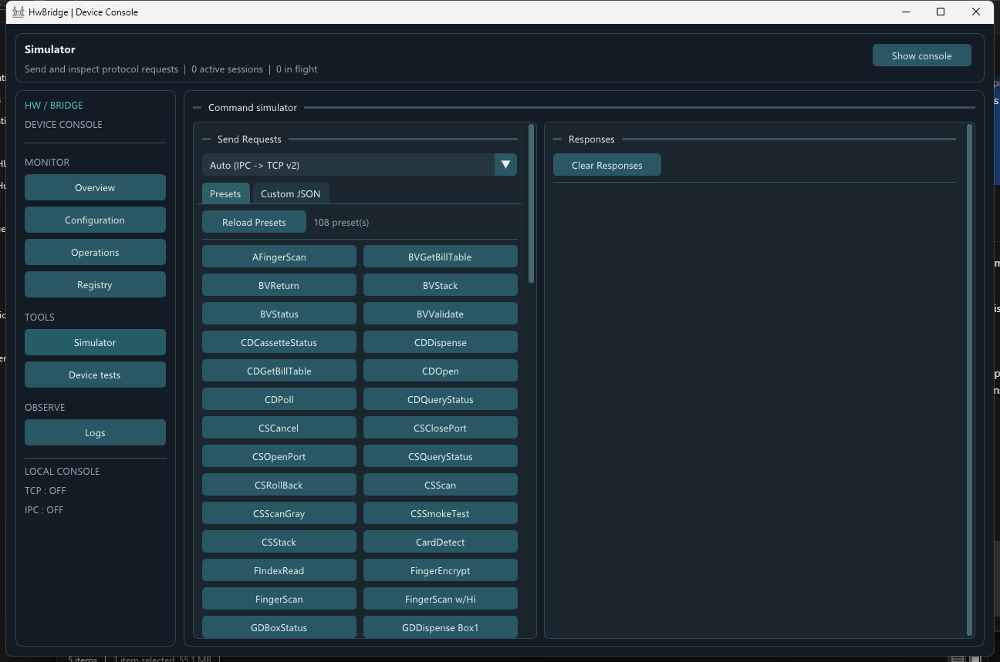
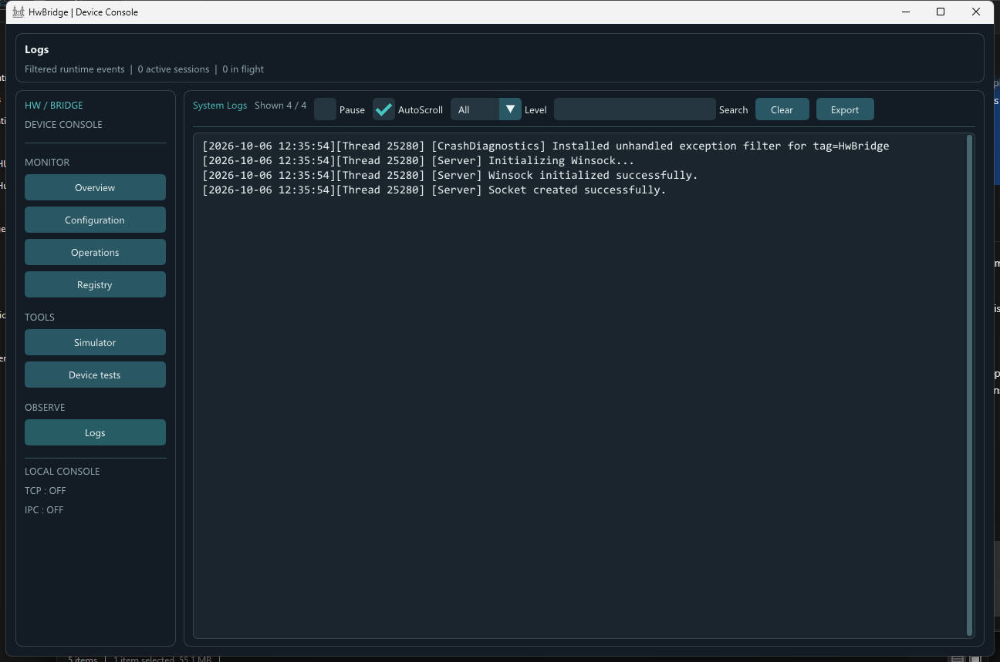

# HwBridge

HwBridge is a Windows C++ hardware bridge for ATM and kiosk applications. It gives client applications a stable command interface while isolating vendor SDK calls in supervised worker processes.

This repository is a code-free project showcase. It contains screenshots and a C++ language marker for GitHub language detection; it does not contain the HwBridge implementation.

## UI Showcase

The optional development console provides operational visibility and local configuration tools.

| Configuration | Command simulator |
| --- | --- |
|  |  |

## Architecture

- C++17 Windows supervisor with an optional Dear ImGui development interface.
- Legacy TCP compatibility alongside multiplexed protocol-v2 TCP and local named-pipe IPC.
- Dedicated worker processes isolate vendor SDK calls from the network and UI threads.
- Worker health supervision tracks restarts and unavailable device lanes.
- Device-specific handlers preserve the established ATM Engine request and response contract.

## Device Families

The project includes integrations for check scanners, card readers, fingerprint readers, Evolis printers, bill validators, cash and gold dispensers, and selected XFS device classes. Availability depends on the deployed vendor SDK and connected hardware.

## Protocol

Legacy clients continue using the existing JSON request envelope. New clients can use protocol v2 over TCP or the local named pipe for request IDs, multiplexing, targeted cancellation, deadlines, and bounded framing.

The public command list and implementation source are maintained in the separate HwBridge project. This showcase intentionally has no device source code or SDK binaries.
